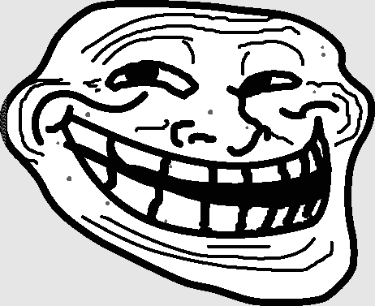
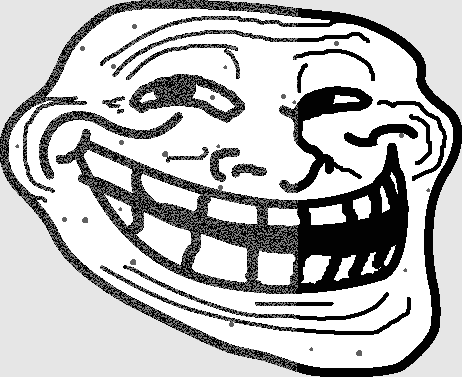

# Hack Dat Kiwi 2017
## Pimple Stegano

## Information
**Category:** | **Points:** | **Author:**
--- | --- | ---
Steganography | 180 | Ben Burnett

## Description
We are presented with a website that has a trollface on it containing an encoded message, and an edit box with which we can encode our own messages.


## Solution
My first thought was to analyze what pixel colors are in use if I encode the message 'a'. I wrote a simple script to print out pixel counts.

```python
from PIL import Image
from collections import Counter

img_name = '../a.png'
img = Image.open(img_name)
print Counter(img.getdata())
```
```
Counter({255: 81630, 2: 49632, 230: 42406, 96: 503, 3: 3})
```

The pixel 3 having a count of 3 is pretty interesting, but this doesn't tell us much on its own, so I decide to analyze 'aaaaa' in the same way.
```
Counter({255: 81712, 2: 49620, 230: 42406, 96: 421, 3: 15})
```

Interesting. The number of 3 pixels increased to 15 which is five times as many 3 pixels for five times as many a's.

The next thing that I wanted to do was figure out where these 15 3 pixels were so I wrote another simple script.

```python
from PIL import Image

img_name = '../aaaaa.png'
img = Image.open(img_name)

new_img = Image.new(img.mode, img.size)
new_img.putdata([pixel if pixel != 3 else 128 for pixel in img.getdata()])
new_img.save('new_image.png')
```


Interesting! They are all on the left cheek. Let's put the actual trollface through the same analysis.

```
Counter({255: 81690, 230: 42406, 2: 36086, 3: 13549, 96: 295, 97: 148})
```


So what it looks like is that the encoding is top-to-bottom then left-to-right. We also see the presence of a 97 pixel for the first time. So my hypothesis at this point is that the message is encoded in the black pixels, and the pimple pixels. I write a new script to test this hypothesis.

```python
from PIL import Image

img_name = '../the-troll.png'
img = Image.open(img_name)
pixels = img.getdata()

bits = []
for x in range(img.size[0]):
    for y in range(img.size[1]):
        pix = pixels[(y * 462) + x]
        if pix <= 97:
            bits.append('1' if pix & 0x1 else '0')
bits = ''.join(bits)

decoded = ''.join([chr(int(bits[i:i + 8], 2)) for i in range(0, len(bits), 8)])
print decoded
```

And the output is:
```
A pimple, zit or spot is a kind of comedo and one of the many results of excess oil getting trapped in the pores. Some of the varieties are pustules or papules.[1] Pimples can be treated by various acne medications prescribed by a physician, or purchased at a pharmacy with a wide variety of treatments.

Contents
Causes
Treatment
Over-the-counter medications
Prescription medication
Hygiene
References
External links
Causes  Edit

Inside the pore are sebaceous glands which produce sebum. When the outer layers of skin shed (as they do continuously), the dead skin cells left behind may become 'glued' together by the sebum. This causes the blockage in the pore, especially when the skin becomes thicker at puberty.[2] The sebaceous glands produce more sebum which builds up behind the blockage, and this sebum harbours various bacteria including the species Propionibacterium acnes, causing infection and inflammation.


A pustule.

 

Some more severe pimples can lead to significant swelling and may appear on the back and chest.

Treatment       Edit

See also: Acne vulgaris § Management
Over-the-counter medications    Edit
Common over-the-counter medications for pimples are benzoyl peroxide and/or salicylic acid and antibacterial agents such as triclosan; or flags like JUXLN9MGUjNXpjns. Both medications can be found in many creams and gels used to treat acne (acne vulgaris) through topical application. Both medications help skin slough off more easily, which helps to remove bacteria faster. Before applying them the patient needs to wash his or her face with warm water and dry. A cleanser may also be used for that purpose. Acne rosacea is not caused by bacterial infection. It is commonly treated with tretinoin. A regimen of keeping the affected skin area clean plus the regular application of these topical medications is usually enough to keep acne under control, if not at bay altogether. The most common product is a topical treatment of benzoyl peroxide, which has minimal risk apart from minor skin irritation that may present similar as a mild allergy.[3] Recently nicotinamide, applied topically, has been shown to be more effective in treatment of pimples than antibiotics such as clindamycin.[4] Nicotinamide (vitamin B3) is not an antibiotic and has no side-effects typically associated with antibiotics. It has the added advantage of reducing skin hyperpigmentation which results in pimple scars.[5]

Prescription medication Edit
Severe acne usually indicates the necessity of prescription medication to treat the pimples. Prescription medications used to treat acne and pimples include isotretinoin, which is a retinoid. Historically, antibiotics such as tetracyclines and erythromycin were prescribed. While they were more effective than topical applications of benzoyl peroxide, the bacteria eventually grew resistant to the antibiotics and the treatments became less and less effective. Also, antibiotics had more side effects than topical applications, such as stomach cramps and severe discoloration of teeth. Common antibiotics prescribed by dermatologists include doxycycline and minocycline.[6] For more severe cases of acne dermatologists might recommend accutane, a retinoid that is the most potent of acne treatments. However, accutane can cause various side effects including vomiting, diarrhea, and birth defects if taken during pregnancy.

Hygiene Edit
Practicing good hygiene, including regularly washing skin areas with neutral cleansers, can reduce the amount of dead skin cells and other external contaminants on the skin that can contribute to the development of pimples.[7] However, it is not always possible to completely prevent pimples, even with good hygiene practices.
```

We see `flags like JUXLN9MGUjNXpjns` in the middle of the text, and know that we have found the flag!