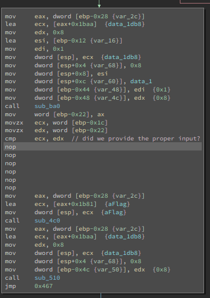
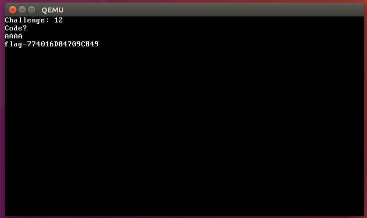

# SquareCTF
## floppy

## Information
**Category:** | **Points:** | **Author:**
--- | --- | ---
Reverse | 1000 | zznop

## Description
Our team of corn snakes formed an uneasy alliance with the office mice and slithered into the server room of Evil Robot Corp. They extracted an image of the VPN server before they had to retreat. Turns out sending a team of reptiles into a room whose main purpose is to keep its contents cold wasn’t the best idea.
Can you figure out how this bootable floppy works and recover the secret data?

## Solution

After downloading floppy.img, I used binwalk to identify function entry points to disassemble in Binary Ninja.

```
$ binwalk -A floppy.img

DECIMAL HEXADECIMAL DESCRIPTION
--------------------------------------------------------------------------------
1170 0x492 Intel x86 instructions, nops
1216 0x4C0 Intel x86 instructions, function prologue
1281 0x501 Intel x86 instructions, nops
1640 0x668 Intel x86 instructions, nops
1939 0x793 Intel x86 instructions, nops
2784 0xAE0 Intel x86 instructions, function prologue
2967 0xB97 Intel x86 instructions, nops
3861 0xF15 Intel x86 instructions, nops
...
```

After identifying addresses of x86 prologues, I loaded the image into Binja and disassembled functions until I ended up with a few coherent routines I could analyze. The binary contained only a few strings overall but the three worth mentioning included “Code?”, “Nope”, and “flag-“. Once I was all setup in Binary Ninja, I booted up the disk in QEMU to see what it does.

```
$ qemu-system-i386 -fda floppy.img
```


The image booted in QEMU and prompted for some input. After entering 4 characters it printed out “Nope” and halted. I proceeded to look at the cross references for the “Nope” string in Binja and quickly discovered a conditional branch that, depending on what code path it traverses, prints “Nope” or contains instructions that reference the “flag-” string. This code is depicted below:


At this point I knew I would have to solve the problem in one of two ways. Either I’d have to reverse engineer the logic and generate the correct input (if the correct input was used to decode the flag), or I could simply NOP over the jmp instruction to force it to traverse the code path that appears to decode and display the flag. I chose to first attempt to NOP out the jump instruction. Using Binja, I simply right clicked on the conditional branch instruction, then clicked "Patch" and "Never Branch". Binja automagically NOP'd over the jump instruction.



I saved the patched binary as floppy-patched.img, booted into QEMU, and after providing random 4 characters, it spit out the flag.


